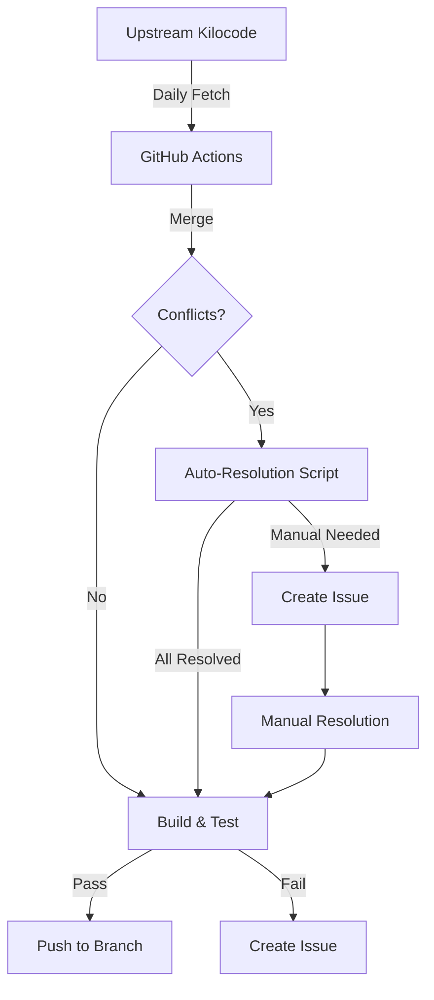

# Upstream Synchronization Guide

This document explains how to keep your fork synchronized with the upstream Kilocode repository while preserving custom providers like the Copilot integration.

## Overview

This repository contains custom extensions to the Kilocode codebase, including:

- **Copilot Provider**: GitHub Copilot integration for using Copilot models

These customizations require special handling when merging upstream changes to ensure they are preserved.

## Automated Sync (Recommended)

A GitHub Actions workflow automatically syncs with upstream daily.

### How It Works

1. **Daily Schedule**: The workflow runs at midnight UTC every day
2. **Conflict Detection**: Automatically detects merge conflicts
3. **Auto-Resolution**: Known conflict patterns are resolved automatically
4. **Build Verification**: Ensures the merged code compiles successfully
5. **Issue Creation**: If manual intervention is needed, an issue is created

### Manual Trigger

You can manually trigger the sync:

1. Go to **Actions** → **Sync Upstream**
2. Click **Run workflow**
3. Optionally specify:
    - `force_merge`: Attempt auto-resolution even with conflicts
    - `target_branch`: Branch to sync (default: `feature/add-copilot-support`)

## Manual Sync Process

If you need to sync manually:

### Step 1: Fetch Upstream

```bash
# Add upstream remote if not already added
git remote add upstream https://github.com/kilocode/kilocode.git

# Fetch latest changes
git fetch upstream main
```

### Step 2: Merge

```bash
# Ensure you're on your feature branch
git checkout feature/add-copilot-support

# Merge upstream
git merge upstream/main
```

### Step 3: Resolve Conflicts

If conflicts occur, use the auto-resolution script:

```bash
node scripts/resolve-upstream-conflicts.js
```

Or resolve manually, ensuring:

1. **Provider exports** in `src/api/providers/index.ts` include `CopilotHandler`
2. **Provider settings** in `packages/types/src/provider-settings.ts` include:
    - `copilot` in `dynamicProviders`
    - `copilot` in `providerNames`
    - `copilotModelId` in `modelIdKeys`
    - `copilotSchema` definition
3. **CLI labels** in `cli/src/constants/providers/labels.ts` include copilot
4. **CLI validation** in `cli/src/constants/providers/validation.ts` include copilot

### Step 4: Build and Test

```bash
pnpm install
pnpm run build
pnpm run test
```

### Step 5: Commit and Push

```bash
git add -A
git commit -m "chore: sync with upstream kilocode"
git push origin feature/add-copilot-support
```

## Conflict Patterns

### Common Conflict Files

| File                                        | Resolution Strategy                          |
| ------------------------------------------- | -------------------------------------------- |
| `src/api/providers/index.ts`                | Keep all exports, ensure copilot is included |
| `packages/types/src/provider-settings.ts`   | Merge arrays, ensure copilot entries exist   |
| `cli/src/constants/providers/labels.ts`     | Merge all labels                             |
| `cli/src/constants/providers/validation.ts` | Merge all validations                        |
| `pnpm-lock.yaml`                            | Use upstream, regenerate with `pnpm install` |
| `*.md`                                      | Use upstream version                         |

### Auto-Resolution Script

The `scripts/resolve-upstream-conflicts.js` script handles these patterns automatically:

```bash
# After a failed merge
git merge upstream/main
# Conflicts detected...

# Run auto-resolution
node scripts/resolve-upstream-conflicts.js

# Review and commit
git diff --staged
git commit -m "Merge upstream with preserved copilot provider"
```

## Adding New Custom Providers

If you add new custom providers, update the conflict resolution:

1. Edit `scripts/resolve-upstream-conflicts.js`
2. Add your provider to the `CUSTOM_PROVIDERS` object:

```javascript
const CUSTOM_PROVIDERS = {
	copilot: {
		name: "Copilot",
		handler: "CopilotHandler",
		modelIdKey: "copilotModelId",
		label: "GitHub Copilot",
		files: ["src/api/providers/copilot.ts", "src/api/providers/fetchers/copilot.ts"],
	},
	// Add your provider here
	myProvider: {
		name: "My Provider",
		handler: "MyProviderHandler",
		modelIdKey: "myProviderModelId",
		label: "My Custom Provider",
		files: ["src/api/providers/my-provider.ts"],
	},
}
```

## Troubleshooting

### Build Fails After Merge

1. Check for missing dependencies:

    ```bash
    pnpm install
    ```

2. Check for TypeScript errors:

    ```bash
    pnpm run check-types
    ```

3. Look for breaking API changes in upstream

### Workflow Doesn't Run

1. Ensure the workflow file is on the default branch
2. Check GitHub Actions permissions in repository settings
3. Verify the schedule syntax is correct

### Too Many Conflicts

If upstream has diverged significantly:

1. Consider rebasing instead of merging:

    ```bash
    git rebase upstream/main
    ```

2. Or create a fresh branch:
    ```bash
    git checkout upstream/main
    git checkout -b feature/add-copilot-support-v2
    # Cherry-pick or re-apply your changes
    ```

## Best Practices

1. **Sync frequently**: Daily syncs prevent large conflict buildups
2. **Keep changes minimal**: Touch as few upstream files as possible
3. **Use comments**: Mark custom code with `// copilot_change` comments
4. **Test thoroughly**: Always build and test after syncing
5. **Document changes**: Update this guide when adding new customizations

## Architecture Diagram



## Related Files

- `.github/workflows/sync-upstream.yml` - GitHub Actions workflow
- `scripts/resolve-upstream-conflicts.js` - Conflict resolution script
- `src/api/providers/copilot.ts` - Copilot provider implementation
- `src/api/providers/fetchers/copilot.ts` - Copilot authentication
